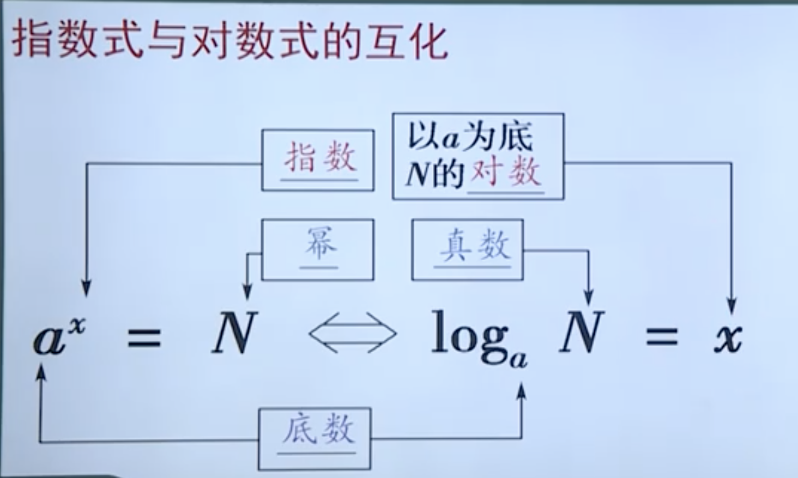

## 定义
本质是任意角的集合与一个比值的集合的变量之间的映射，通常的三角函数是在平面直角坐标系中定义的。
[参考视频链接](https://haokan.baidu.com/v?pd=wisenatural&vid=13908001139696945673)
- 在一个单位元内（半径为1），设α是一个任意角，它的终边OP与单位圆相交于点P(x,y)，  
- 那么把点P的纵坐标y叫做α的正弦函数,记做sinα,即y=sinα;
  - 所以在一二象限，sin为正
- 把点P的横坐标x叫做α的余弦函数，记做cosα，即x= cosα ;
  - 所以在一四象限，cos为正
- 把点P的纵坐标与横坐标的比值一叫做α的正切函数，记做tanα，即y/x=tanα
  - 所以在一三象限，tan为正

### 直角三角形
- 正弦sin = 对边/斜边
- 余弦cos = 领边/斜边
- 正切tan = 对边/领边
- 余切cot = 领边/对边
- 正割sec = 斜边/领边
- 余割csc = 斜边/对边

### 任意三角形
需要转换成xy二位坐标系中计算。r为原点到对应xy点的线
- 正弦sin = y/r
- 余弦cos = x/r
- 正切tan = y/x
- 余切cot = x/y
- 正割sec = r/x
- 余割csc = r/y

## 函数公式
### 倒数关系
- tanα*cotα=1
- sinα*cscα=1
- cosα*secα=1
### 商数关系
- tanα=sinα/cotα
- cotα=cosα/sinα
### 平方关系
- 1+cot²α=csc²α
- sin²α+cos²α=1
- 1+tan²α=sec²α

## 诱导公式
1. 公式一：设α为任意角，终边相同的角的同一三角函数的值相等
2. 公式二：设α为任意角，π+α的三角函数值与α的三角函数值之间的关系
   1. sin(π+α)=-sinα
   2. cos(π+α)=-cosα
   3. tan(π+α)=tanα
   4. cot(π+α)=cotα
3. 公式三：任意角α与-α的三角函数值之间的关系
   1. sin(-α)=-sinα
   2. cos(-α)=cosα
   3. tan(-α)=-tanα
   4. cot(-α)=-cotα
4. 公式四：利用公式二和公式三可以得到π-α与α的三角函数值之间的关系
   1. sin(π－α)=sinα
   2. cos(π－α)=－cosα
   3. tan(π－α)=－tanα
   4. cot(π－α)=－cotα
5. 公式五：利用公式一和公式三可以得到2π-α与α的三角函数值之间的关系
   1. sin(2π－α)=－sinα
   2. cos(2π－α)=cosα
   3. tan(2π－α)=－tanα
   4. cot(2π－α)=－cotα
6. 公式六：π/2±α与α的三角函数值之间的关系
   1. sin(π/2+α)=cosα
   2. sin(π/2－α)=cosα
   3. cos(π/2+α)=－sinα
   4. cos(π/2－α)=sinα
   5. tan(π/2+α)=－cotα
   6. tan(π/2－α)=cotα
   7. cot(π/2+α)=－tanα
   8. cot(π/2－α)=tanα

记背诀窍：**奇变偶不变，符号看象限**，形如(kπ)/2 ± α，k为奇数，正弦变余弦，余弦变正弦，正切变余切，余切变正切。形如kπ ± α，则函数名称不变。符号看象限，指的原表达式，根据原表达式在对应象限的正负决定。

## 基本公式
### 二角和差公式
- cos(α+β)=cosα·cosβ-sinα·sinβ
- cos(α-β)=cosα·cosβ+sinα·sinβ
- sin(α±β)=sinα·cosβ±cosα·sinβ
- tan(α+β)=(tanα+tanβ)/(1-tanα·tanβ)
- tan(α-β)=(tanα-tanβ)/(1+tanα·tanβ)
- cot(α+β)=(cotα·cotβ-1)/(cotβ+cotα)
- cot(α-β)=(cotα·cotβ+1)/(cotβ-cotα)

### 三角和公式
- sin(α+β+γ)=sinα·cosβ·cosγ + cosα·sinβ·cosγ + cosα·cosβ·sinγ - sinα·sinβ·sinγ
- cos(α+β+γ)=cosα·cosβ·cosγ + cosα·sinβ·sinγ + sinα·cosβ·sinγ - sinα·sinβ·sinγ

### 积化和差公式
- sinα·cosβ = (sin(α+β) + sin(α-β))/2
- cosα·sinβ = (sin(α+β) - sin(α-β))/2
- cosα·cosβ = (cos(α+β) + cos(α-β))/2
- sinα·sinβ = (cos(α+β) - cos(α-β))/2
### 和差化积公式
- sinα + sinβ = 2sin((α+β)/2)cos((α-β)/2)
- sinα - sinβ = 2cos((α+β)/2)sin((α-β)/2)
- cosα + cosβ = 2cos((α+β)/2)cos((α-β)/2)
- cosα - cosβ = -2sin((α+β)/2)sin((α-β)/2)
### 倍角公式
可以通过上面的二角和差公式推导，
- sin2α = sinα·cosα + cosα·sinα = 2sinα·cosα
- cos2α = cosα·cosα - sinα·sinα = cos²α - sin²α = 2cos²α - 1 = 1 - 2sin²α
- tan2α = (2tanα)/(1-tan²α)
- 其他倍角推导方式一样
升幂缩角公式:  
通过上面的公司可以推出平方公式
- cos²α = (1 + cos2α)/2
- sin²α = (1 - cos2α)/2
### 万能公式
- sinα = (2tan(α/2))/(1+tan²(α/2))
- cosα = (1-tan²(α/2))/(1+tan²(α/2))
- tanα = (2tan(α/2))/(1-tan²(α/2))
### 辅助角公式
如果出现同一个角的sin、cos，利用二角和差公式来推导，提出两个系数的平方和开更，消除cos（sin的二角和差公式更简单）
- asinβ + bcosβ = √(a²+b²)( sinβ(a/√(a²+b²)) + cosβ(b/√(a²+b²)) )
- 其中a/√(a²+b²)是常熟，假设对应的角度为γ
- asinβ + bcosβ = √(a²+b²)sin(β+γ)
- 其中cosγ = a/√(a²+b²)；sinγ = b/√(a²+b²)
### 余弦定理
abc分别代表三条边,ABC代表对应边的角
- a² = b²+c²-2bc·cosA
- b² = a²+c²-2ac·cosB
- c² = a²+b²-2ab·cosC
### 三角函数公式算面积
三角形的面积等于两邻边及其夹角正弦值的乘积的一半
S△ABC= 1/2ab·sinC = 1/2bc·sinA = 1/2ac·sinB
### 反三角函数
- y = arcsin(x)，定义域[-1,1] ，值域[-π/2,π/2]
- y = arccos(x)，定义域[-1,1] ， 值域[O,π]
- y = arctan(x)，定义域(-∞,+∞)，值域(-π/2,π/2)
- sinarcsin(a)=x,定义域[-1,1],值域 [-π/2,π/2]
### 反三角函数公式
函数存在反函数充分必要条件是：定义域和值域两集合之间具有一一对应关系。因此正函数和反函数都必须为单调函数，而三角函数是周期函数，要想使它有反函数，只有设定在一个单调区间内。我们把三角函数的反函数称为反三角函数。
#### 余角关系
- arcsin(x)+arccos(x)=π/2
- arctan(x)+arccot(x)=π/2
- arcsec(x)+arccsc(x)=π/2

#### 负数关系
- arcsin(-x)=-arcsin(x)
- arccos(-x)=π-arccos(x)
- arctan(-x)=-arctan(x)
- arccot(-x)=π-arccot(x)
- arcsec(-x)=π-arcsec(x)
- arcsec(-x)=-arcsec(x)

#### 倒数关系
- arcsin(1/x)=arccsc(x)
- arccos(1/x)=arcsec(x)
- arctan(1/x)=arccot(x)=π/2-arctan(x)(x＞0)
- arccot(1/x)=arccot(x)=π/2-arccot(x)(x＞0)
- arccot(1/x)=arctan(x)+π=3π/2-arccot(x)(x＜0)
- arcsec(1/x)=arccos(x)
- arccsc(1/x)=arcsin(x)

#### 同角关系

## 对数log

## 字符读音
α：Alpha，音标 /ælfə/，中文读音为“阿尔法”
β：beta，音标/'beitə/，中文读音为“贝塔”
γ: gamma，音标/'gæmə/，中文读音为“伽玛”
δ：delta，音标/'deltə/，中文读音为“得尔塔”
ε：epsilon，音标/ep'silon/，中文读音为“艾普西隆”
ζ：zeta，音标/'zi:tə/，中文读音为“泽塔”
η：eta，音标/'i:tə/，中文读音为“伊塔”
θ：theta，音标/'θi:tə/，中文读音为“西塔”
ι：iota，音标//，中文读音为“约塔”
κ：kappa，音标/'kæpə/，中文读音为“卡帕”
λ：lambda，音标/'læmdə/，中文读音为“拉姆达”
μ：mu，音标/mju:/，中文读音为“谬”
ν：nu，音标/nju:/，中文读音为“纽”
ξ：xi，音标/ksi/，中文读音为“克西”
ξ：xi，音标英美 /ˈzaɪ/ 或 /ˈksaɪ/，中文读音为“克西”
ο：omicron，音标/əuˈmaikrən/或 /ˈɑmɪˌkrɑn/，中文读音为“奥米克戎”
π：pi，音标/paɪ/，中文读音为“派”
ρ：rho，音标/rəʊ/，中文读音为“柔”
σ， ς：sigma，音标/'sɪɡmə/，中文读音为“西格玛”
τ：tau，音标/tɔ:/ 或 /taʊ/，中文读音为“陶”
υ：upsilon，音标/ˈipsilon/或 /ˈʌpsɨlɒn/，中文读音为“阿普西龙”
φ：phi，音标/faɪ/，中文读音为“斐”
χ：chi，音标/kaɪ/，中文读音为“恺”
ψ：psi，音标/psaɪ/，中文读音为“普西”
ω：omega，音标/'əʊmɪɡə/或 /oʊ'meɡə/，中文读音为“奥米伽”

## 字符代表的类型
1. N代表：全体非负整数的集合，通常简称非负整数集（或自然数集）；
2. N+（或N*）：非负整数集内排除0的集，也称正整数集
3. Z代表：全体整数的集合通常称作整数集；
4. Q代表：全体有理数的集合通常简称有理数集；整数和分数的统称
5. CrQ代表：无理数，也称为无限不循环小数，不能写作两整数之比。若将它写成小数形式，小数点之后的数字有无限多个，并且不会循环。 
6. R代表：全体实数的集合通常简称实数集；包含所有有理数和无理数的集合
7. C代表：复数集合计。