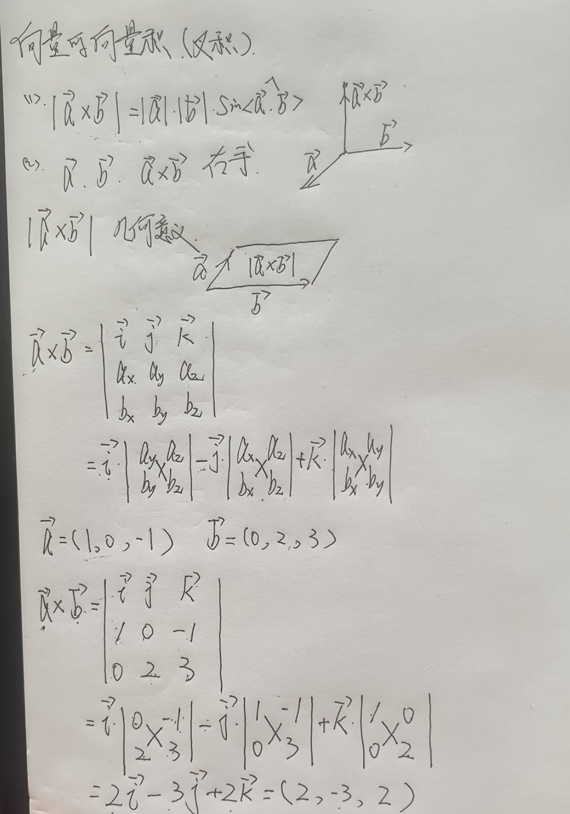

## 定义
向量是计算几何中的基本概念，指一个同时具有大小和方向的几何对象。  
与数字一样，一个向量中也有反向量、零向量、等向量等。  
若一个向量与它的大小相同，但方向相反，则称它为反向量。  
若一个向量的始点与终点重合，也就是重合点的向量，则称它为零向量。零向量具有方向性，但方向不定。  
若两个向量长度、方向相等，即为等向量，缺一不可。  
规定长度为1的向量为单位向量，可以把一个非零向量归一化为一个单位向量。  
## 向量运算
### 向量加减法
向量的加法满足平行四边形法则和三角形法则。
#### 平行四边形法则
- 加法
  - 以它们为邻边构成的平行四边形对应夹角的对角线就是他们的和
- 减法
  - 可以将减去的向量取反方向，以求和的形式计算
#### 三角形法则
- 加法
  - 将一条向量平移到另一条向量的终点，构成三角形，第三条边就是他们的和
- 减法
  - 可以将减去的向量取反方向，以求和的形式计算
### 向量的数乘
可以理解为一个标量K和一个向量做乘法，结果是向量大小的K倍的向量，方向取决于K的正负
### 向量的点乘（内积、数量积）
向量a乘以向量b = a、b的模长乘以夹角的cos值  
最终两个向量的点乘得到的是一个实数。
### 向量的叉积
向量的叉积也称为向量的向量积、外积，它的结果是一个向量。是对三维空间中的两个向量的二元运算，使用符号×
- |a×b| = |a||b|sin<a,b>
  - 这是模的大小
  - 这个大小也等于，a、b向量组成的平行四边形的面积
- 方向遵循右手法则，谁在前，四指方向就指向谁的方向，大拇指的方向，就是结果向量的方向
- 具体算法需要使用三阶行列式
